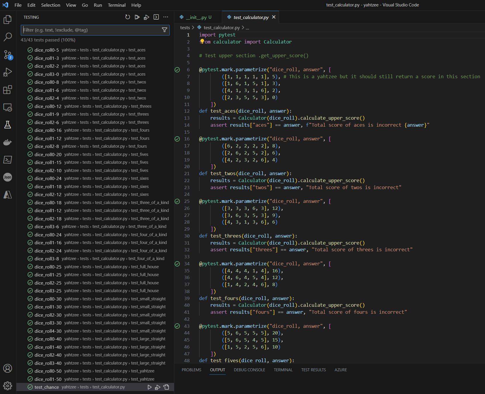

# Yahtzee Game/ Scorer

- Github project board
- Github workflow
- Github branches
- pytest unit testing for the score calculator
- python

The code uses a github workflow, everytime a pull request is made a set of unit tests are automatically run on the code via pytest to ensure the core code is always working.
I used a github project board to support my test driven development and broke work into small and achievable pieces and I asked for support around TDD from a mentor for this project.
One area of learning here was the difference between the design process and the building/ coding process and how the design process is more about behaviour driven development and the building and coding of the core score calculator was more about the test driven development. It took time for me to appreciate how BDD and TDD interact with my game design.

#Project Plan
The plan here is to have Yahtzee in 2 forms:
- as a command line game, where the computer rolls the dice for a max of 6 players and track the score
- as a scorer that can be used to score individual dice rolls

===
# TDD
This is a rewarding screenshot of the tests for my core calculator passing.
