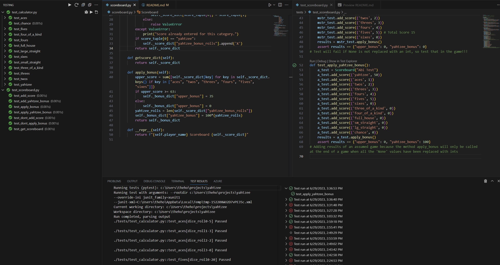

# Yahtzee Scorer

- Test Driven Development (TDD) - Pytest and Pexpect
- Using the debugger to problem solve
- Github project, workflow & branches
```bash
	# to run the command lines game and see the tests for my logic
	pip install -r requirements.txt
	python game.py
```

### A Command Line Scoring Program:
- The **calculator class** can be used as a scorer that can be used to score individual dice rolls
```bash 
    # use score calculator to calculate result of a single turn, insert your dice roll into the list
    my_dice_roll = [6,6,6,6,6]
    test_player = Calculator(my_dice_roll)
```
- The **scoreboard class** contains methods that can be called to produce a scoreboard during the game and an overall score at the end of a game.
```bash
	# to run an example game and see the scoreboard working against a test computer player
	game = Play_game()
	game.play_game()
	# user input required for dice roll on each turn
	# alternatively see the files test_whole_game.py & test_scoreboard.py
```

## Development Overview

This repository represents use of **GitHub workflows** to ensure the continuous quality of our code. Every time a pull request is initiated, a batch of unit tests is executed automatically on the proposed code. This is achieved using `pytest`, a robust Python testing tool, which ensures that the core functionality of the code remains intact at all times. 

My development approach leaned heavily on **Test-Driven Development (TDD)**. This methodology emphasizes writing tests before the actual code. As illustrated in the image below, my TDD workflow involved using `pytest` for unit testing and `Pexpect` for integration testing. This project has also really given me an opportunity to use the **debugger** to debug tests and code. Use of the debugger helped me to quickly and easily spot a late night error in my own tests.

To manage my tasks effectively, I utilized a **GitHub project board**, splitting my objectives into manageable, achievable segments. This practice was instrumental in keeping the project on track and my goals clear.

===
# TDD
A rewardingly green screenshot to show how I developed using unittests in pytest.


